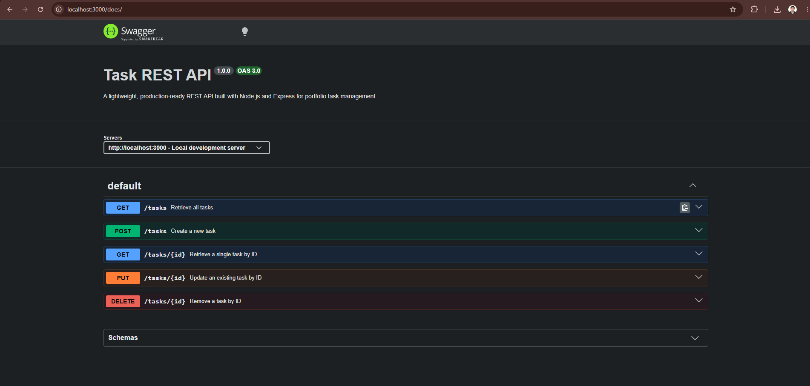

# Task Management REST API

A lightweight, production-ready REST API built using Node.js and the Express framework. This application handles data management completely in memory, making it an excellent demonstration of RESTful routing architectures, strict data validation, and automated interactive documentation.

## Features

* **Full CRUD Operations**: Implementations for creating, reading, updating, and deleting tasks.
* **Input Validation**: Robust structural verification for incoming request bodies to prevent malformed data entry.
* **Health Monitoring**: A dedicated endpoint designed to support automated uptime detection hooks.
* **Interactive API Docs**: Integrated OpenAPI specification served visually via Swagger UI.

---

## Technical Architecture

* **Runtime Environment**: Node.js
* **Application Framework**: Express
* **Documentation Standard**: OpenAPI 3.0.0
* **Data Storage**: Local In-Memory Array

---

## Installation and Setup

Follow these steps to configure and run the application locally on your computer.

### 1. Install Dependencies
Run the installation command to fetch the required project modules:
```bash
npm install
```

### 2. Start the Server
Launch the application process. The server will dynamically listen on the port specified by environment variables, or default to port 3000:
```bash
npm start
```

### API Documentation

#### Endpoints Overview

| Method | Endpoint | Description | Status Codes |
| :--- | :--- | :--- | :--- |
| **GET** | `/` | Retrieve API metadata layout | 200 OK |
| **GET** | `/health` | Check application operational status | 200 OK |
| **GET** | `/tasks` | Retrieve the entire task array collection | 200 OK |
| **GET** | `/tasks/:id` | Fetch an individual task by its unique numeric ID | 200 OK, 404 Not Found |
| **POST** | `/tasks` | Create a new task with validation rules | 201 Created, 400 Bad Request |
| **PUT** | `/tasks/:id` | Perform full structural updates on a specific task | 200 OK, 400 Bad Request, 404 Not Found |
| **DELETE**| `/tasks/:id` | Remove a specific task from the active array memory | 204 No Content, 404 Not Found |

#### Interactive Dashboard

The interactive API documentation interface can be viewed directly in your web browser at the following address while the server is running:
[http://localhost:3000/docs](http://localhost:3000/docs)



#### Sample Request Verification Output

Below is a verified example log displaying the headers and body payload returned by the server when executing a valid task modification request:

```plaintext
HTTP/1.1 200 OK
X-Powered-By: Express
Content-Type: application/json; charset=utf-8
Content-Length: 47
ETag: W/"2f-56QWNdDkTfj4tD28luqkbzF74Nk"
Date: Sun, 19 Jul 2026 01:46:26 GMT
Connection: keep-alive
Keep-Alive: timeout=5

{"id":4,"title":"Buy organic milk","done":true}
```