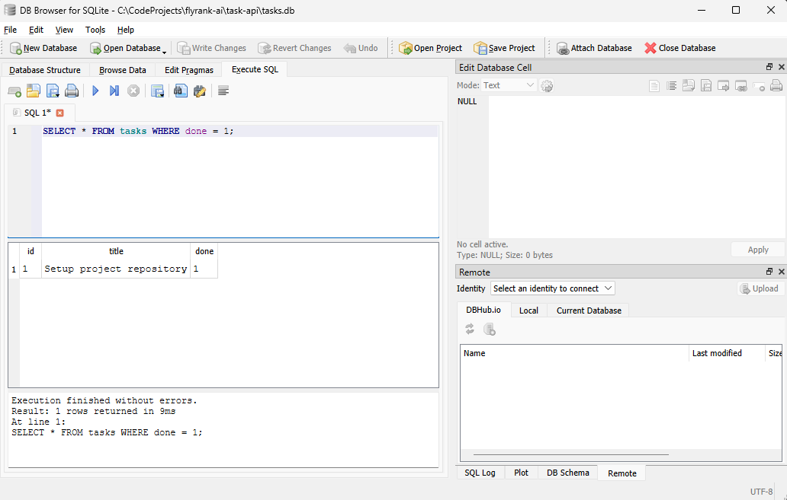

# Task Management REST API

A lightweight, production-ready REST API built using Node.js and the Express framework, backed by a persistent SQLite database. This application handles data management through a disk-backed SQL storage engine, demonstrating RESTful routing architectures, parameterized query safety, strict data validation, and automated interactive documentation.

## Features

* **Full CRUD Operations**: Implementations for creating, reading, updating, and deleting tasks persisted directly in SQLite.
* **Disk Persistence**: Reliable file-based storage ensuring data survives server restarts without data loss.
* **Input Validation**: Robust structural verification for incoming request bodies to prevent malformed data entry.
* **Health Monitoring**: A dedicated endpoint designed to support automated uptime detection hooks.
* **Interactive API Docs**: Integrated OpenAPI specification served visually via Swagger UI.

---

## Technical Architecture

* **Runtime Environment**: Node.js
* **Application Framework**: Express
* **Database Engine**: SQLite (utilizing native `node:sqlite`)
* **Documentation Standard**: OpenAPI 3.0.0
* **Data Storage**: File-Based Relational Store (`tasks.db`)

---

## Database Architecture and Persistence

### Why SQLite?
SQLite was selected for the storage layer because it provides a lightweight, serverless, zero-configuration relational database engine stored directly inside a single local file (`tasks.db`). This eliminates the need to install or run a separate background database server while providing complete SQL query capabilities and true disk persistence.

### Database Initialization and Seeding
* **Storage Location**: The database file lives at `./tasks.db` in the project root. It is added to `.gitignore` so each clone automatically generates its own isolated environment.
* **Automatic Provisioning**: Upon application startup, the database file and the `tasks` table are automatically created if they do not exist.
* **Idempotent Seeding**: Three initial example tasks are seeded only when the table is completely empty, ensuring data is not duplicated across server restarts.

### Table Schema
* `id`: INTEGER PRIMARY KEY AUTOINCREMENT
* `title`: TEXT NOT NULL
* `done`: INTEGER NOT NULL DEFAULT 0 (converted dynamically to boolean in API responses)

### Executed Verification SQL Query
Below is an example SQL query executed against `tasks.db` inside DB Browser for SQLite to inspect active tasks:

```sql
SELECT * FROM tasks WHERE done = 1;
```

### Installation and Setup
Follow these steps to configure and run the application locally on your computer.

## 1. Install Dependencies
Run the installation command to fetch the required project modules:
```bash
npm install
```

## 2. Start the Server
Launch the application process. The server will dynamically initialize the database and listen on the port specified by environment variables, or default to port 3000:
```bash
npm start
```

### API Documentation

#### Endpoints Overview

| Method | Endpoint | Description | Status Codes |
| :--- | :--- | :--- | :--- |
| **GET** | `/` | Retrieve API metadata layout | 200 OK |
| **GET** | `/health` | Check application operational status | 200 OK |
| **GET** | `/tasks` | Retrieve all stored tasks from SQLite | 200 OK |
| **GET** | `/tasks/:id` | Fetch an individual task by its unique numeric ID | 200 OK, 404 Not Found |
| **POST** | `/tasks` | Create a new task in SQLite with validation rules | 201 Created, 400 Bad Request |
| **PUT** | `/tasks/:id` | Perform structural updates on a specific task in SQLite | 200 OK, 400 Bad Request, 404 Not Found |
| **DELETE**| `/tasks/:id` | Remove a specific task row from SQLite | 204 No Content, 404 Not Found |

### Interactive Swagger UI Dashboard

The interactive API documentation interface can be viewed directly in your web browser at the following address while the server is running:  
[http://localhost:3000/docs](http://localhost:3000/docs)


### Database Management GUI Verification

Below is a snapshot of the `tasks.db` file opened inside DB Browser for SQLite, verifying direct database access and row persistence:



### Sample Request Verification Output

Below is a verified example log displaying the headers and body payload returned by the server when executing a valid task modification request against the SQLite database:

```plaintext
HTTP/1.1 200 OK
X-Powered-By: Express
Content-Type: application/json; charset=utf-8
Content-Length: 55
ETag: W/"37-M4DVRj+UD0HSLasPkZE/..."
Date: Fri, 24 Jul 2026 11:46:30 GMT
Connection: keep-alive
Keep-Alive: timeout=5

{"id":1,"title":"Setup project repository","done":true}
```